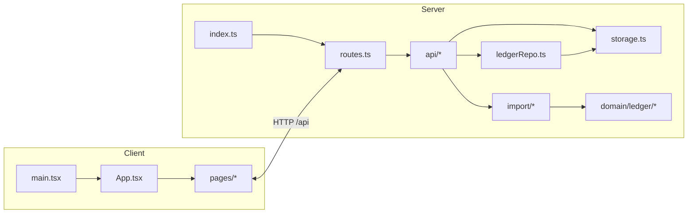

# Arquitetura do FinancaPerp

Este documento descreve a arquitetura da aplicação, os pontos de entrada e o papel dos arquivos específicos do projeto (sem detalhar componentes primitivos de UI em `client/src/components/ui/*`, nem configs puramente de ferramentas).

## Arquitetura geral

É um **monólito**: um servidor **Express** sobe o **HTTP**, registra as rotas `/api/*` e, conforme o ambiente:

- **Desenvolvimento**: integra o **Vite** ao mesmo `httpServer` para servir o React com HMR (`server/vite.ts`).
- **Produção**: o client é buildado e servido como arquivos estáticos (`server/static.ts`).

O banco é **SQLite** via **Drizzle** (`@libsql/client`). Há **dois “mundos” de dados** que convivem:

1. **App financeiro clássico** – categorias, transações do mês, orçamentos, metas → principalmente `storage.ts` + tabelas em `shared/schema.ts`.
2. **Ledger de importação** – contas bancárias, lotes de import, linhas brutas/normalizadas, auditoria → `ledgerRepo.ts` + rotas em `api/imports.ts`. O que entra na lista de “Transações” após import passa pelo **commit** que projeta o ledger para a tabela `transactions`.

O front é **React 18**, roteamento por **hash** (`wouter` + `useHashLocation`), dados com **TanStack Query** (`client/src/lib/queryClient.ts`).

## Pontos de entrada

| Onde | Função |
|------|--------|
| `server/index.ts` | **Entrada do processo Node**: `createApp()`, middleware de erro global, escolhe Vite (dev) ou estáticos (prod), `listen` na porta (padrão 5000). |
| `client/src/main.tsx` | **Entrada do SPA**: garante hash `#/` e monta `<App />` no `#root`. |
| `npm run dev` → `tsx server/index.ts` | Como se sobe o app no dia a dia. |
| `npm run build` → `script/build.ts` | Build do client (Vite) + bundle do servidor (esbuild) para `dist/`. |
| `npm start` → `node dist/index.cjs` | Produção. |

Fluxo lógico: **`index.ts` → `createApp()` (`app.ts`) → `registerRoutes()` (`routes.ts`)**; o client fala com **`/api/...`** no mesmo host/porta.

## Camada compartilhada

| Arquivo | Função |
|---------|--------|
| `shared/schema.ts` | **Contrato de dados**: tabelas Drizzle (categorias, transações, orçamentos, metas, **accounts**, **imports**, **ledger**, etc.) e schemas Zod de insert usados na API. |

## Servidor – núcleo e HTTP

| Arquivo | Função |
|---------|--------|
| `server/app.ts` | Cria `express()` + `httpServer`, JSON/urlencoded, logging de `/api`, chama `registerRoutes`. |
| `server/routes.ts` | **Aglutina rotas**: contas, importações/ledger, categorias, transações, orçamentos, metas, seed. |
| `server/static.ts` | Em produção, serve o build estático do client. |
| `server/vite.ts` | Em dev, pluga o middleware Vite no Express. |

## Servidor – API de domínio

| Arquivo | Função |
|---------|--------|
| `server/api/accounts.ts` | `GET/POST /api/accounts` (contas do ledger). |
| `server/api/imports.ts` | **Importação**: upload multipart, parse, normalização, persistência em imports/raw/ledger, dedupe, reprocess, patch em ledger, **commit** para `transactions`. |
| `server/api/imports.int.test.ts` | Teste de integração da API de import. |

## Servidor – persistência

| Arquivo | Função |
|---------|--------|
| `server/infra/db.ts` | Cliente Drizzle/libsql apontando para `DATABASE_URL` ou `file:./data.db`. |
| `server/storage.ts` | **CRUD** das entidades “app” (categorias, transações simples, orçamentos, metas) via Drizzle. |
| `server/infra/ledgerRepo.ts` | **Repositório do ledger**: contas, imports, arquivos, raw/ledger transactions, auditoria, **`commitLedgerToAppTransactions`** (projeta no livro simples). |

## Servidor – domínio ledger (regras)

| Arquivo | Função |
|---------|--------|
| `server/domain/ledger/types.ts` | Tipos (`RawTxnCandidate`, kinds, convenções, etc.). |
| `server/domain/ledger/rules/v1.ts` | Classificação (compra, transferência, estorno, tarifa…) e **sinal** canônico. |
| `server/domain/ledger/normalizer.ts` | Parse de valor, fingerprint, normalização de um candidato → linha ledger. |
| `server/domain/ledger/pipeline.ts` | Orquestra normalização em lote + agrupamentos de transferência. |
| `server/domain/ledger/postings.ts` | Lógica de **transfer groups** entre linhas normalizadas. |
| `server/domain/ledger/dedupe.ts` | Heurística de duplicidade por fingerprint entre linhas do mesmo import. |
| `server/domain/ledger/*.test.ts` | Testes unitários das regras/normalização/dedupe. |

## Servidor – importação (arquivo → candidatos)

| Arquivo | Função |
|---------|--------|
| `server/import/parser.ts` | Lê buffers upload: PDF, CSV, XLSX, OFX, TXT, imagem+OCR → `RawDocument[]`. |
| `server/import/mappers/index.ts` | Despacha por `source` do documento para CSV/XLSX/OFX ou bloco único para texto não estruturado. |
| `server/import/mappers/genericCsv.ts` | CSV genérico: delimitador, cabeçalhos PT/EN, colunas data/descrição/valor. |
| `server/import/mappers/genericXlsx.ts` | Primeira planilha → candidatos (alinhado às mesmas ideias de colunas/datas). |
| `server/import/mappers/genericOfx.ts` | OFX → candidatos. |
| `server/import/columnHints.ts` | Normalização de cabeçalhos e matchers (data/descrição/valor). |
| `server/import/dateParse.ts` | Conversão de strings (e alguns números estilo Excel) para `YYYY-MM-DD`. |
| `server/import/mappers/genericCsv.test.ts` | Testes do mapper CSV. |

## Cliente – app (fora de `components/ui`)

| Arquivo | Função |
|---------|--------|
| `client/src/App.tsx` | Providers (Query, Tooltip, Sidebar, Router hash), layout com sidebar/header, rotas para páginas, `POST /api/seed` no mount. |
| `client/src/components/app-sidebar.tsx` | Menu lateral e links entre rotas. |
| `client/src/components/theme-toggle.tsx` | Alternância claro/escuro. |
| `client/src/pages/dashboard.tsx` | Dashboard inicial. |
| `client/src/pages/transacoes.tsx` | Lista por mês, criar/excluir transação, **importar** (FormData + commit). |
| `client/src/pages/orcamentos.tsx` | Orçamentos por categoria/mês. |
| `client/src/pages/metas.tsx` | Metas financeiras. |
| `client/src/pages/not-found.tsx` | Rota 404. |
| `client/src/lib/queryClient.ts` | `fetch` base, `apiRequest`, `apiRequestFormData`, `queryClient` e `getQueryFn`. |
| `client/src/lib/utils.ts` | Helpers de UI (ex.: `cn`, formatação de moeda/data/mês). |
| `client/src/hooks/use-toast.ts` | Toasts (usado com `@/components/ui/toaster`). |
| `client/src/hooks/use-mobile.tsx` | Breakpoint mobile para sidebar/comportamento responsivo. |

## Outros arquivos do repo (não-framework)

| Caminho | Função |
|---------|--------|
| `script/build.ts` | Pipeline de build produção (client + server). |
| `Examples/ai.ts`, `Examples/parser.ts` | Exemplos/snippets, **fora** do fluxo principal da app. |

**De propósito não detalhado neste documento**: `tailwind.config.ts`, `vite.config.ts`, `tsconfig.json`, `drizzle.config.ts`, `vitest.config.ts`, `components.json`, `postcss.config.*` e **toda a pasta `client/src/components/ui/`** — são configuração de ferramentas ou biblioteca de componentes.

## Diagrama resumido do fluxo

